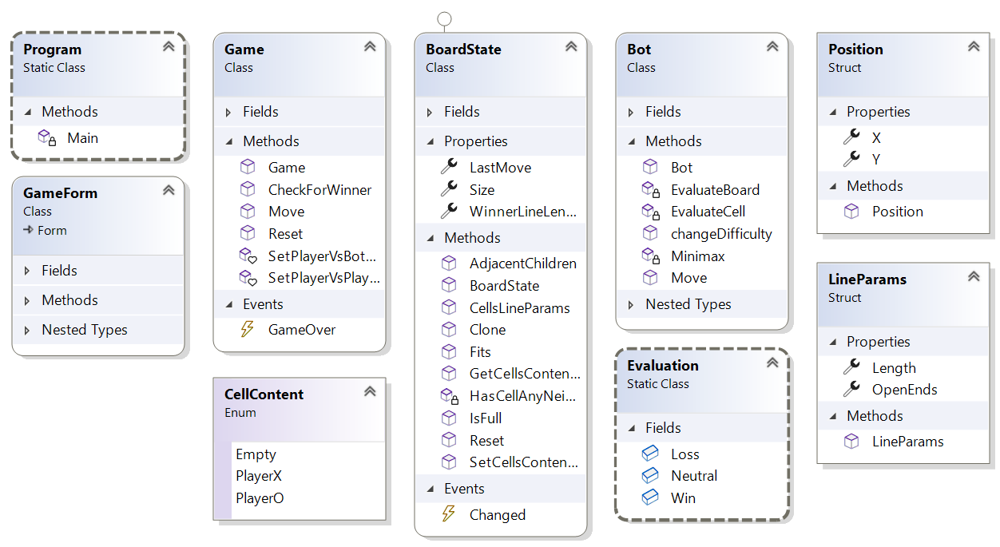

# Five In a Row

## User Documentation
- Five In a Row is also called [Gomoku](https://en.wikipedia.org/wiki/Gomoku)
- This is the freestyle version - winning line can be longer than 5
- Player has blue crosses, Bot has red circles
- Player Vs Player also possible
- To make a move, click on an empty cell
- After game over, you can click "RESET" and the one who didn't start last game will start now.

## Developer Big Picture Documentation
This project uses the MVC Architecture and Events
- *GameForm.cs* is the View, it is a WinForms Form. Other classes except *Program.cs* don't know that this class exists.
- *Game.cs* is the Controller and contains the game logic.
- *Board.cs* is the Model, it has no references to other classes
- *Bot.cs* is also Model and contains the simple Minimax AI of the enemy, it's just a static function class and only knows about *Board* class
- *Program.cs* - only for startup, here we connect events and listeners.

## Events
*Board* raises event *Changed* and *Game* raises event *GameOver*, both are processed only by *GameForm*. The subscriptions are given in Program.cs so that other classes don't need a reference to *GameForm*.

## Class Diagram

## How the Bot works
It is Minimax algorithm using alpha-beta pruning.

Board's evaluation is based on each cell's evaluation.

Cell's evaluation is based on the lines it is contained in. (line = sequence of cells of the same non empty type)
All factors are:
- Length of the line
- Whether the line has zero, one or two open ends
- Whether the line is made of Os or Xs
- Who plays next

